# 面向智能硬件客服场景的可治理 Agent 平台

这是一个面向扫地 / 扫拖机器人的 **RAG + 多工具 Agent + Harness 控制层** 项目。项目不仅覆盖知识库问答、天气 / 环境适配、用户设备使用记录查询、个性化报告生成，也把 Agent 应用生产化中常见的控制问题纳入架构：统一状态、预算停止、动态工具策略、真实人工审批、答案验证、artifact 留存、诊断 trace、评测门禁和服务化交付。

一句话概括：

> `ReactAgent` 负责 ReAct 推理和工具调用，`AgentRunner` 负责请求级控制；工具、RAG、MCP、审批、artifact、trace、metrics 都围绕 Harness 形成可治理的 Agent 运行框架。

---

## 1. 功能概览

- **RAG 知识库**：从 `data/` 中的 PDF / TXT 构建 Chroma 向量库，以真实 Dense 分数和中文 BM25 双路召回，经 RRF 融合及可选 Cross-Encoder 精排后生成 evidence 与引用。
- **多工具 Agent**：支持知识库检索、天气、用户位置、用户 ID、当前月份、使用记录查询和报告上下文切换。
- **Harness 控制层**：统一 `AgentRunner` / `AgentState`，支持预算停止、动态工具策略、真实审批、答案验证、artifact 存储和诊断 trace。
- **动态工具治理**：`ToolRegistry` 管工具元数据，`ToolPolicy` 从版本化 YAML 加载 tenant / role / scene / tool / args 规则，输出可审计的 `allow / deny / need_approval / need_redaction` 决策。
- **真实 HITL 审批**：敏感工具如 `fetch_external_data` 会进入 `SQLiteApprovalStore`，普通用户需审批，operator / admin 可审批。
- **答案质量闸门**：`AnswerVerifier` 依次执行结构校验、Claim-Evidence 对齐与危险结论检测，仅在高风险或低置信时选择性调用 `LLMJudge`。
- **产物留存**：`SQLiteArtifactStore` 按 request_id 保存 final answer、verification failure、evidence、tool results 等运行产物。
- **服务化入口**：FastAPI 暴露 `/chat`、`/chat/stream`、`/harness/run`、审批、artifact、MCP、trace、metrics、judge 等接口。
- **MCP 工具服务**：支持 JSON-RPC `initialize`、`tools/list`、`tools/call`；MCP 工具调用同样经过 ToolPolicy 和审批存储。
- **可观测性**：包含 request/tool/model trace、diagnostic event、OpenTelemetry 风格 span、Prometheus 指标，以及带序号、心跳、背压和断线重放的实时 SSE 事件流。
- **评测门禁**：PR 运行 30 条冻结真实检索排名和 62 条离线 Agent golden，校验固定阈值及相对基线退化；真实模型评测由独立工作流定期执行。

---

## 2. 环境与启动

推荐 Python 3.10.x，本项目使用 Python 3.10.11 验证。

```powershell
python -m venv .venv
.\.venv\Scripts\Activate.ps1
python -m pip install -U pip
pip install -e ".[dev]"
Copy-Item .env.example .env
```

在 `.env` 中配置 `DASHSCOPE_API_KEY`。

加载知识库：

```powershell
python -m rag.vector_store
```

启动 Streamlit 演示：

```powershell
streamlit run app.py
```

启动 FastAPI 服务：

```powershell
uvicorn api.server:app --host 0.0.0.0 --port 8000
```

启动 MCP stdio server：

```powershell
python mcp_server.py
```

---

## 3. 常用接口

| 接口                                    | 作用                                                         |
| --------------------------------------- | ------------------------------------------------------------ |
| `GET /health`                           | 健康检查                                                     |
| `GET /tools/manifest`                   | 导出工具 manifest                                            |
| `POST /chat`                            | 兼容聊天入口，内部走 Harness                                 |
| `POST /chat/stream`                     | 实时 SSE 事件流，支持 token、工具、审批、验证、artifact、心跳与重连重放 |
| `POST /harness/run`                     | 推荐生产入口，返回 status / approval_id / verifier / artifacts |
| `GET /approvals/{approval_id}`          | 查询审批记录                                                 |
| `POST /approvals/{approval_id}/approve` | 审批通过，仅 operator / admin                                |
| `POST /approvals/{approval_id}/deny`    | 审批拒绝，仅 operator / admin                                |
| `GET /artifacts/{request_id}`           | 按 request_id 查询产物                                       |
| `GET /artifact/{artifact_id}`           | 查询单个 artifact                                            |
| `POST /plan`                            | Planner 多任务接口                                           |
| `POST /judge`                           | LLM-as-Judge 批量评测接口                                    |
| `POST /mcp`                             | HTTP JSON-RPC MCP 入口                                       |
| `GET /metrics`                          | Prometheus 文本指标                                          |
| `GET /metrics/snapshot`                 | JSON 指标快照                                                |
| `GET /traces/{request_id}`              | 查询 trace payload                                           |
| `GET /traces/{request_id}/otel`         | 导出 OpenTelemetry 风格 spans                                |

入口关系：

- `/harness/run` 是推荐的生产控制入口。
- `/chat` 保留兼容旧调用方，但内部已经调用 `AgentRunner`，不会绕过审批、artifact、trace 和 verifier。
- `/chat/stream` 统一输出 `AgentEvent`；客户端可携带同一 `request_id` 与 `Last-Event-ID` 恢复遗漏事件，跨租户、跨会话或不同 query 复用 request_id 会被拒绝。
- `/mcp tools/call` 由 `MCPToolServer` 执行 ToolPolicy；调用 `fetch_external_data` 等敏感工具时会返回 `pending_approval` 和 `approval_id`，审批通过且参数匹配后才执行。
- `user_role` 不信任 request body，服务端从 `X-User-Role` 等 auth header 中解析；`approve/deny` 需要 `operator` 或 `admin`。

---

## 4. 最新总体架构图

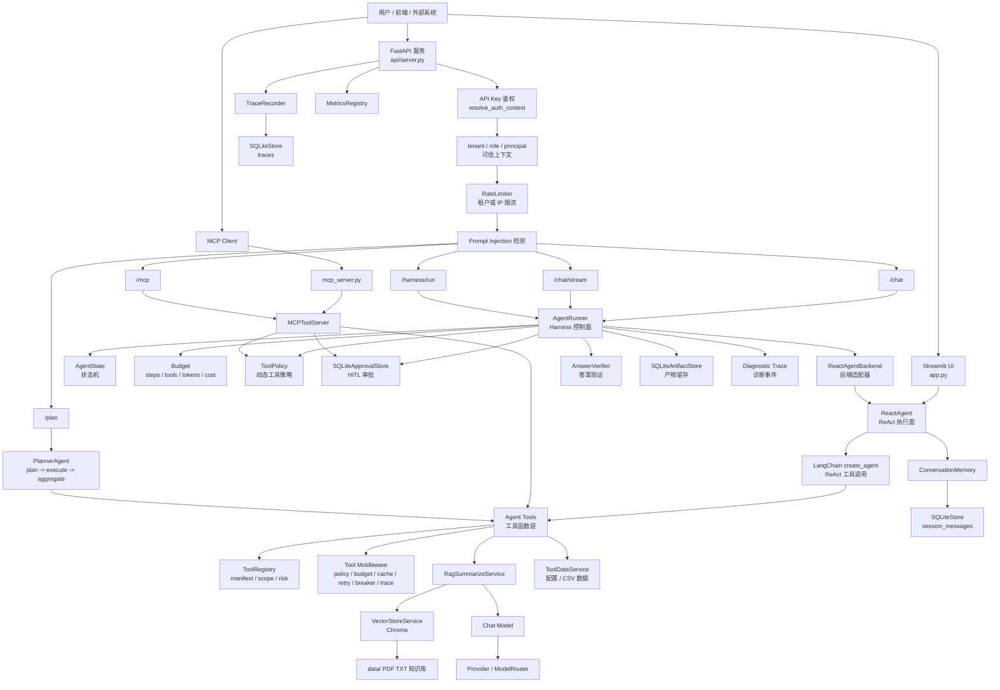

核心分工：

- **执行面**：`ReactAgent`、LangChain ReAct、工具、RAG、数据服务。
- **控制面**：`AgentRunner`、`AgentState`、`Budget`、`ToolPolicy`、审批、Verifier、Artifact、Diagnostic Trace。
- **接入面**：FastAPI、Streamlit、MCP stdio / HTTP。
- **治理面**：鉴权、限流、安全、metrics、trace、评测门禁。

---

## 5. 请求入口与可信上下文架构

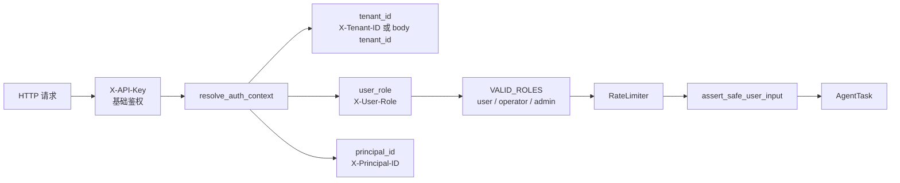

说明：

- `X-API-Key` 只负责基础 API 鉴权。
- `AuthContext` 统一解析 `tenant_id`、`user_role`、`principal_id`。
- `user_role` 不从 request body 中信任读取；生产环境应替换成 API Key / JWT claims。
- `operator` 和 `admin` 属于审批角色，可调用 approve / deny。
- 请求进入 Harness 前仍会经过限流和 Prompt Injection 检测。

---

## 6. Harness 控制层架构

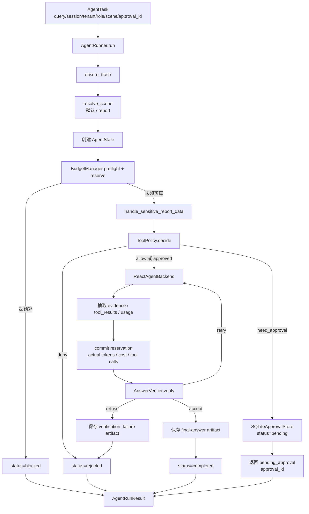

`AgentRunner` 的关键价值：

| 控制职责          | 对应模块                                |
| ----------------- | --------------------------------------- |
| 统一运行输入      | `AgentTask`                             |
| 统一运行状态      | `AgentState`                            |
| 防止无限调用      | `Budget`                                |
| 动态权限裁决      | `ToolPolicy`                            |
| 敏感工具人工审批  | `SQLiteApprovalStore`                   |
| 复用旧 ReAct 执行 | `ReactAgentBackend`                     |
| 输出质量闸门      | `AnswerVerifier`                        |
| 结果留存          | `SQLiteArtifactStore`                   |
| 诊断追踪          | `TraceRecorder.record_diagnostic_event` |

---

## 7. Harness 时序图

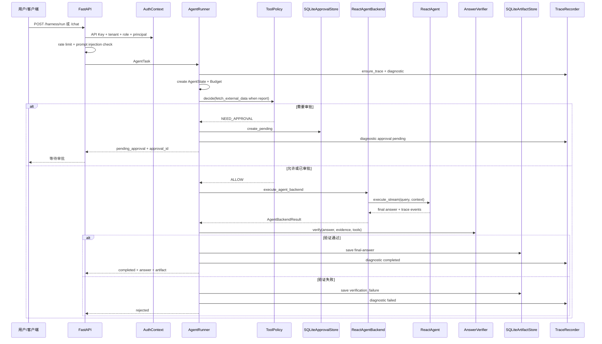

---

## 8. AgentState 状态机

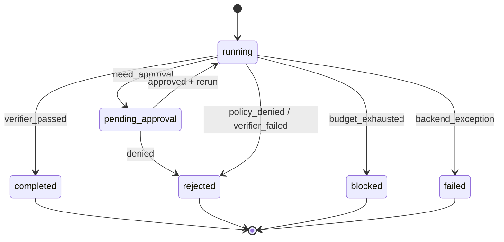

`AgentState` 统一保存：

- `request_id / session_id / tenant_id`
- `user_goal / user_role / scene`
- `steps / observations / tool_calls / artifacts`
- `budget / status / final_answer / error / approval_id`

状态含义：

| 状态               | 含义                 |
| ------------------ | -------------------- |
| `running`          | 正在执行             |
| `pending_approval` | 等待人工审批         |
| `blocked`          | 被预算或前置控制阻断 |
| `failed`           | 后端异常失败         |
| `rejected`         | 策略或验证拒绝输出   |
| `completed`        | 正常完成             |

---

## 9. 策略与审批架构

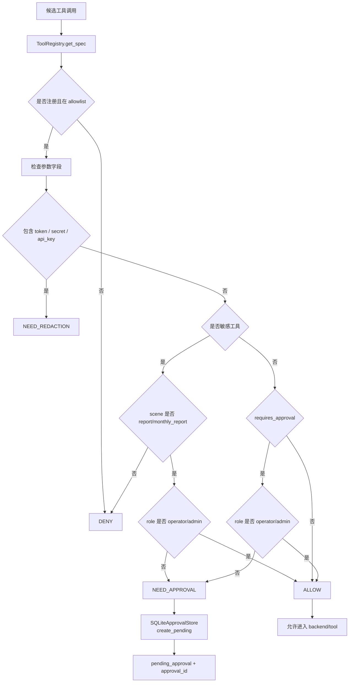

当前核心敏感工具：

| 工具                  | scope               | risk_level | side_effect      | requires_approval |
| --------------------- | ------------------- | ---------- | ---------------- | ----------------- |
| `fetch_external_data` | `usage_record:read` | `medium`   | `read_sensitive` | `true`            |

审批接口：

```text
GET  /approvals/{approval_id}
POST /approvals/{approval_id}/approve
POST /approvals/{approval_id}/deny
```

审批安全规则：

- 只能查询当前 tenant 下的审批记录。
- approve / deny 需要 `operator` 或 `admin`。
- 审批通过后，Runner 和 Tool Middleware 都会校验 `tenant_id` 与 `tool_name` 是否匹配。

---

## 10. ReactAgent 执行面架构

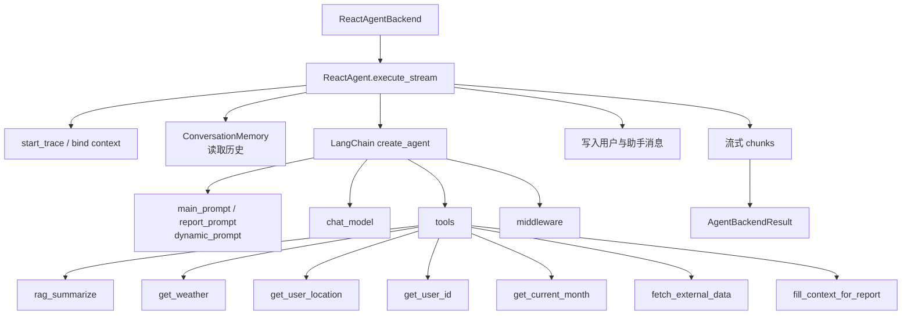

说明：

- `ReactAgentBackend` 是 Harness 和旧 ReAct Agent 之间的适配层。
- Backend 会把 `user_role / scene / approval_id / max_tool_calls` 传入 `ReactAgent.execute_stream`。
- 执行后，Backend 从 trace 中抽取 evidence、tool_results、tokens、cost，封装为 `AgentBackendResult`。
- Harness 不重写 LangChain ReAct loop，只在外层提供控制面能力。

---

## 11. 工具治理架构

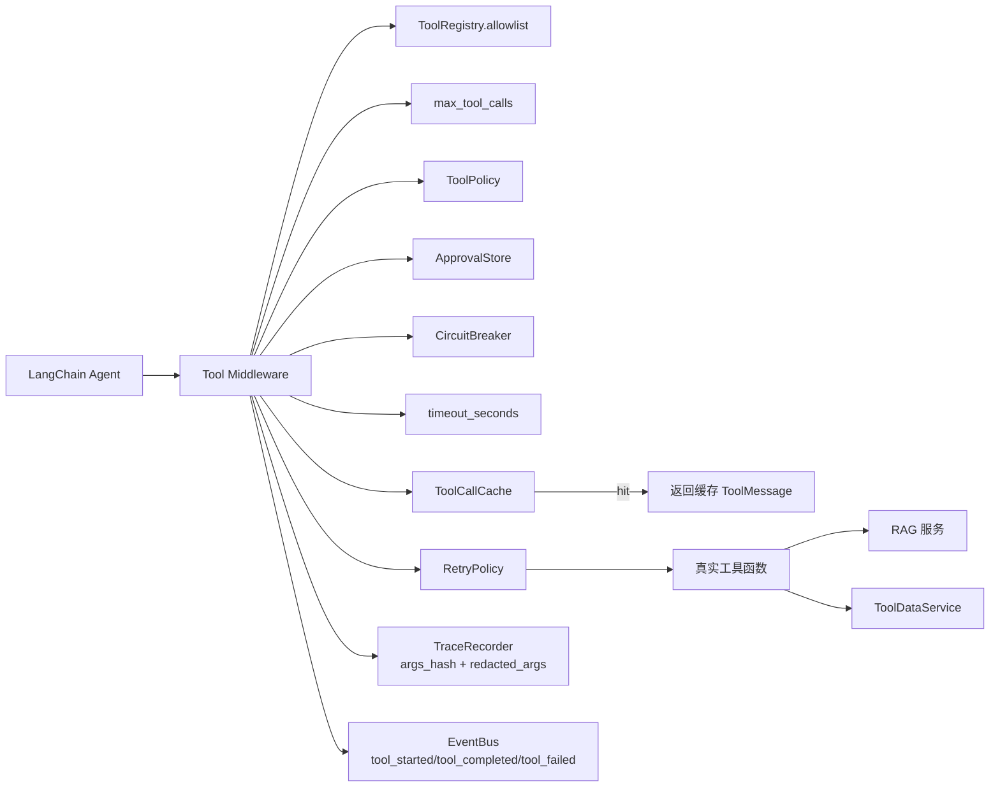

工具中间件的职责：

1. 检查工具是否在 allowlist。
2. 执行工具调用预算控制。
3. 执行 ToolPolicy；需要审批时创建 pending approval 或校验 approval_id。
4. 通过 CircuitBreaker 保护失败工具。
5. 按 `timeout_seconds` 控制工具调用超时。
6. 使用 ToolCallCache 复用幂等工具结果。
7. 用 RetryPolicy 处理偶发失败。
8. trace 中只记录 `args_hash` 和 `redacted_args`，避免泄露敏感参数。
9. 通过 EventBus 发布 `tool_start / tool_end / approval_required`。

---

## 12. RAG 知识库架构

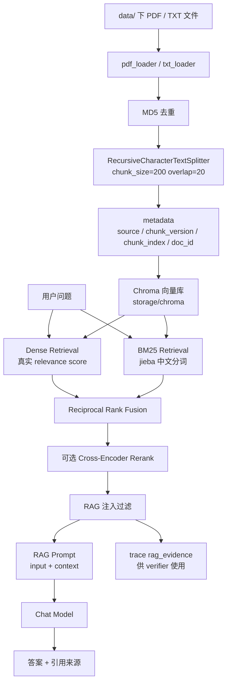

RAG 问答由 `RagSummarizeService` 实现：Dense 与 BM25 分别产生带真实分数和排名的 `RetrievalCandidate`，RRF 在不混用分值尺度的前提下融合候选，可选 reranker 对融合头部精排；最终 evidence 经过注入检测后进入 RAG prompt，并生成稳定文档 ID 的引用。

---

## 13. 报告生成与敏感数据审批链路

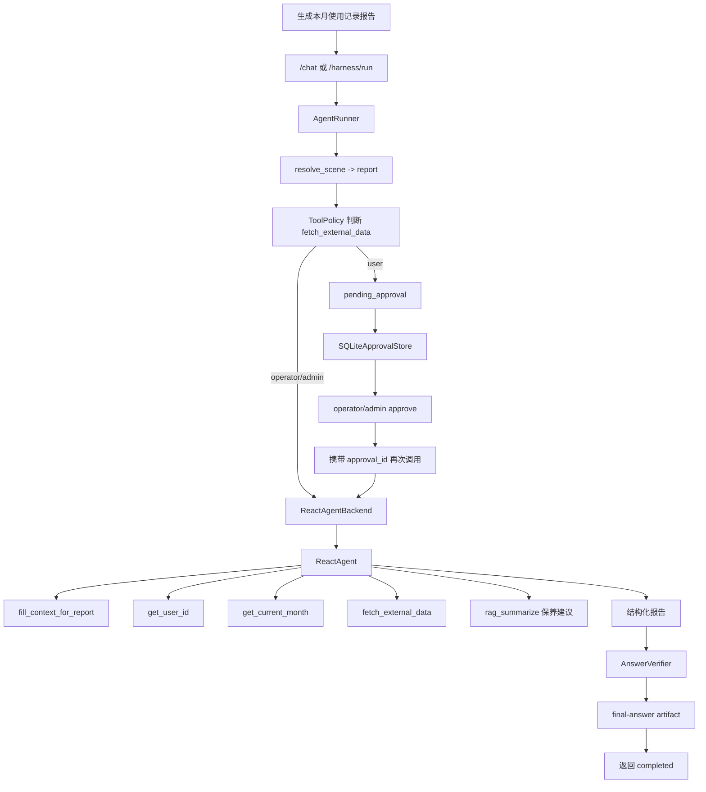

设计要点：

- 报告类请求会被识别为 `report` scene。
- 读取用户使用记录属于 `read_sensitive`，普通用户会先进入审批。
- 审批由 operator / admin 完成，且审批记录按 tenant 隔离。
- 审批通过后，`approval_id` 会进入 Agent runtime context，工具中间件再次校验 approval 与当前租户、工具是否匹配。

---

## 14. Planner 多任务架构

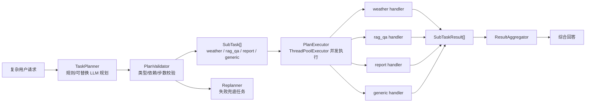

`agent/planner.py` 实现 `plan -> execute -> aggregate`。`TaskPlanner` 根据关键词拆成 `weather / rag_qa / report / generic` 子任务，`PlanExecutor` 可并发执行无依赖任务，`ResultAggregator` 合并结果。`PlanValidator` 和 `Replanner` 为计划型任务增加保护。

---

## 15. MCP 架构

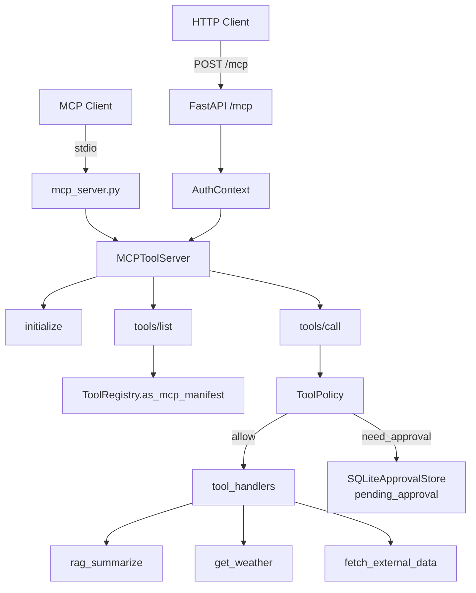

说明：

- `MCPToolServer` 支持 JSON-RPC `initialize`、`tools/list`、`tools/call`。
- `tools/list` 返回带 risk_level、side_effect、requires_approval、timeout_seconds 的 manifest。
- `tools/call` 会经过 ToolPolicy；敏感工具未审批时返回 pending approval，而不是直接调用 handler。
- HTTP `/mcp` 会传入 `AuthContext`，MCP 工具权限与 HTTP Agent 权限保持一致。

---

## 16. 会话记忆与持久化架构

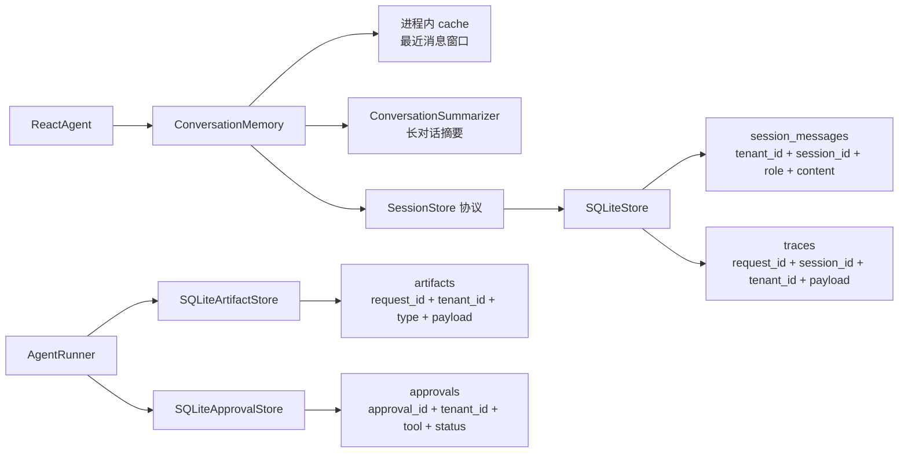

持久化对象：

| 存储                  | 作用                                                         |
| --------------------- | ------------------------------------------------------------ |
| `SQLiteStore`         | session messages 与 traces                                   |
| `SQLiteApprovalStore` | pending / approved / denied 审批记录                         |
| `SQLiteArtifactStore` | final answer、verification failure、evidence、tool_results 等产物 |

---

## 17. 可观测性架构

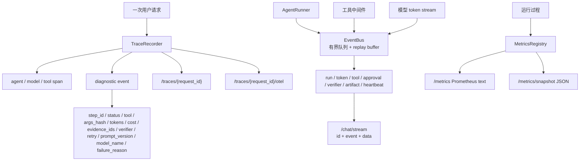

可观测性分层：

- **Trace**：定位单次请求走过哪些步骤。
- **Diagnostic event**：解释 Harness 为什么拦截、审批、重试、拒答或完成。
- **Metrics**：观察整体请求量、延迟、工具调用、RAG 评分、token 等趋势。
- **EventBus**：为每个 request 维护严格递增序号、有界 live queue 和短期 replay buffer；慢消费者触发背压取消，断线客户端用 `Last-Event-ID` 重放。

---

## 18. 缓存、重试、超时、熔断架构

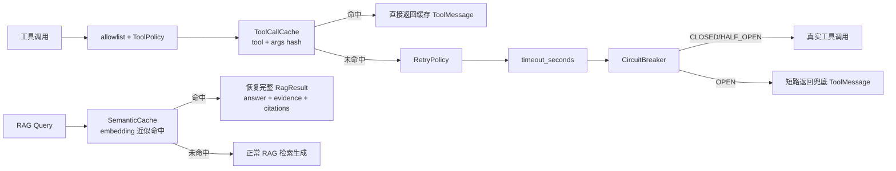

说明：

- 工具调用先过策略，再考虑缓存、重试、超时、熔断。
- `ToolCallCache` 只缓存成功的 `ToolMessage`，避免缓存有副作用的 `Command`。
- `CircuitBreaker` 实现 `CLOSED -> OPEN -> HALF_OPEN -> CLOSED` 三态保护。
- RAG 可启用 `SemanticCache`，缓存完整 `RagResult`；key 隔离 tenant、知识库、语料、prompt、检索和模型版本，避免缓存命中丢失 evidence/citation 或知识库更新后返回旧答案。

---

## 19. 评测与质量门禁架构

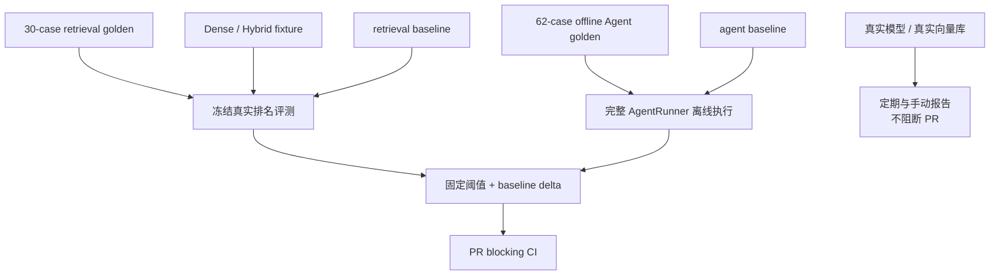

常用命令：

```powershell
python -m pytest tests -q
python -m ruff check .
python scripts/evaluate_retrieval.py --fixture evals/fixtures/retrieval_rankings_v1.json --baseline evals/baselines/retrieval_baseline_v1.json --gate
python scripts/evaluate_agent.py --golden evals/agent_offline_golden.jsonl --mode harness --offline --baseline evals/baselines/agent_baseline_v1.json --gate --min-case-count 60
python scripts/benchmark_api.py --url http://127.0.0.1:8000/chat --api-key dev-api-key
```

PR 门禁同时检查检索 Recall / Precision / MRR / nDCG、Agent pass rate、工具与参数准确率、引用有效性、artifact、P95 延迟和相对基线退化；在线工作流再补充真实模型、真实 embedding 与可选 reranker 的质量报告。

---

## 20. 典型请求链路

### 20.1 普通知识库问答

```mermaid
flowchart LR
    User["主刷缠绕毛发怎么办？"] --> API["/chat"]
    API --> Auth["AuthContext + RateLimit + Safety"]
    Auth --> Runner["AgentRunner"]
    Runner --> Backend["ReactAgentBackend"]
    Backend --> Agent["ReactAgent"]
    Agent --> Tool["rag_summarize"]
    Tool --> RAG["Dense + BM25 + RRF + 可选 Rerank"]
    RAG --> Answer["生成带引用答案"]
    Answer --> Verifier["AnswerVerifier"]
    Verifier --> Artifact["final-answer artifact"]
    Artifact --> Resp["返回 completed"]
```

### 20.2 普通用户生成使用报告


### 20.3 MCP 调用敏感工具

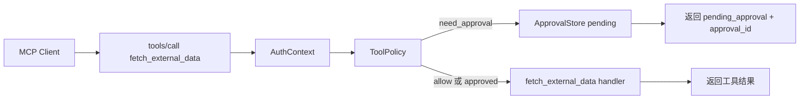

---

## 21. 目录结构与职责

| 目录 / 文件                                    | 职责                                                         |
| ---------------------------------------------- | ------------------------------------------------------------ |
| `app.py`                                       | Streamlit 聊天演示入口                                       |
| `api/server.py`                                | FastAPI 服务入口，集成 auth、harness、approval、artifact、MCP、trace、metrics、judge |
| `agent/react_agent.py`                         | ReAct Agent 执行面，封装 LangChain create_agent、tools、middleware、memory |
| `agent/runner.py`                              | Harness 控制核心：AgentRunner、AgentTask、AgentBackendResult、ReactAgentBackend |
| `agent/state.py` / `agent/budget.py`           | AgentState、统一 BudgetManager、预算预留与提交、StepRecord、Observation、ToolCallRecord |
| `agent/policies.py` / `config/tool_policy.yml` | 版本化、按租户加载且可审计的 ToolPolicy，以及 PlanValidator、Replanner |
| `agent/verifier.py`                            | AnswerVerifier 与 VerifyResult                               |
| `agent/tools/`                                 | LangChain 工具、工具注册表、中间件、重试策略                 |
| `agent/workflows/`                             | 显式业务工作流，目前核心是个人使用报告生成                   |
| `rag/`                                         | Chroma、Dense/BM25/RRF/Rerank、完整语义缓存、RAG 生成、引用与评测 |
| `model/`                                       | 模型工厂、Provider 抽象、多模型路由                          |
| `services/approval_store.py`                   | SQLite 审批状态存储                                          |
| `services/artifact_store.py`                   | SQLite 运行产物存储                                          |
| `services/`                                    | 数据服务、SQLite 持久化、缓存、限流、任务队列、熔断器        |
| `safety/auth.py`                               | 可信 AuthContext、角色解析、审批角色判断                     |
| `safety/security.py`                           | Prompt 注入检测、RAG 注入检测、工具参数校验、脱敏、审批上下文 |
| `observability/`                               | trace、diagnostic event、metrics、事件总线、请求上下文       |
| `mcp_adapter/`                                 | MCP JSON-RPC 适配层                                          |
| `config/`                                      | Agent、RAG、Chroma、Prompt 配置                              |
| `data/`                                        | 知识库文件和外部使用记录数据                                 |
| `docs/`                                        | demo 说明、面试讲稿、Harness 讲稿和架构说明                  |
| `tests/`                                       | 单元测试、Prompt 回归、安全、MCP、RAG、Harness 测试          |
| `evals/`                                       | RAG / Agent golden set 评测数据                              |

---

## 22. 启动与部署架构

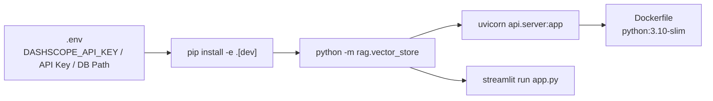

Docker 部署：

```powershell
docker build -t sweeper-agent .
docker run --env-file .env -p 8000:8000 sweeper-agent
```

---

## 23. 核心亮点

第一，**Agent 不是黑盒执行**。新版主链路通过 `AgentRunner` 显式管理状态、预算、审批、验证、artifact 和 diagnostic trace。

第二，**敏感工具有真实治理闭环**。`fetch_external_data` 这类 read_sensitive 工具不再只靠 Prompt 约束，而是由 `ToolPolicy`、`ApprovalStore`、operator/admin 审批和工具中间件共同控制。

第三，**执行面和控制面解耦**。`ReactAgent` 继续负责 ReAct 推理和工具调用，`ReactAgentBackend` 作为适配层接入 Harness，后续可替换为其他 Agent 框架。

第四，**RAG 有完整工程链路**。包括文档加载、指纹去重、chunk 与稳定 ID、Chroma Dense、中文 BM25、RRF、可选 Cross-Encoder、注入过滤、完整结果缓存、引用、evidence trace 和真实检索评测。

第五，**工具体系生产化**。工具有 manifest、scope、risk_level、side_effect、requires_approval、timeout_seconds、allowlist、ToolPolicy、缓存、重试、超时、熔断和 trace。

第六，**质量可以被量化且阻断退化**。PR 对 30 条检索案例和 62 条 Agent 案例执行确定性门禁，并同时比较固定阈值与版本化 baseline；线上模型评测独立运行并产出 artifact。

---

## 24. 当前边界与后续演进

- 当前存储使用 SQLite，适合本地演示和轻量部署；生产环境建议迁移到 Postgres / MySQL，并把缓存、限流和审批短期状态接 Redis。
- `/chat/stream` 已统一模型 token 与 Harness 状态事件；当前 EventBus 是单进程实现，多实例部署应替换为 Redis Streams、NATS 或 Kafka，并共享 replay 状态。
- 审批目前以工具级和场景级控制为主；后续可下沉到真实 user_id / month / 参数级审批，并增加审批过期、一次性消费和审批范围校验。
- Budget 已在调用前预留模型 token/cost 与工具次数，并让 Planner 子任务共享总预算；真实结算精度仍取决于模型 provider 的 usage 元数据。
- ToolPolicy 已由版本化 YAML 按租户、角色、场景和参数约束加载；大规模生产环境可继续迁移到集中式 RBAC/ABAC 策略服务。
- Trace 当前是内存 + SQLite payload；生产环境可接 OpenTelemetry Collector、Jaeger、Tempo 或日志平台。
