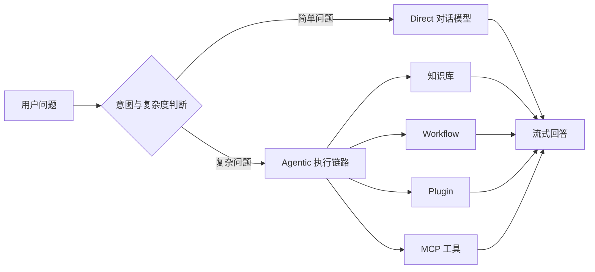
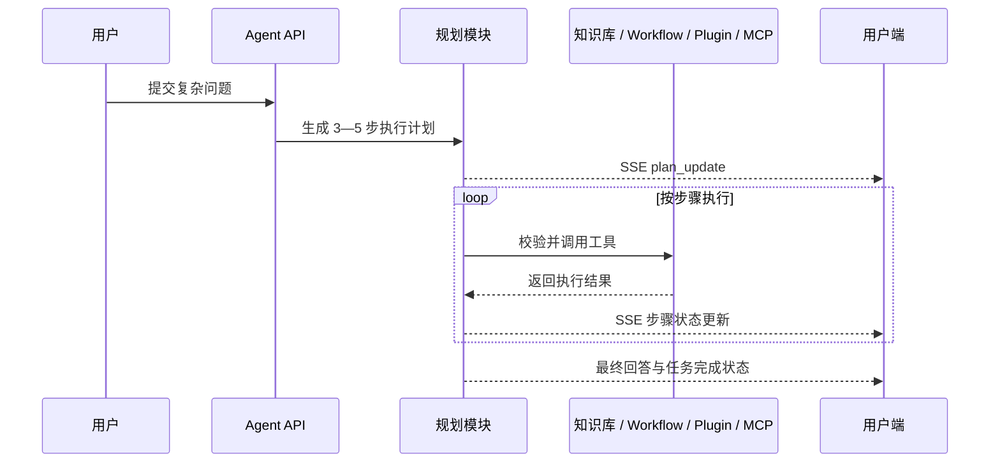
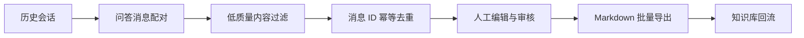
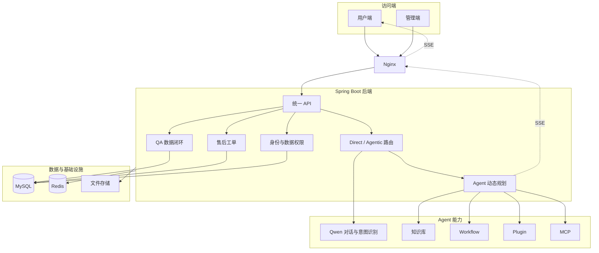

# Farino｜机器人智能客服与 Agent 服务平台

> 面向机器人技术咨询、资料检索与售后服务场景，基于 AIFlowy 进行企业级二次开发的智能客服工作台。

## 项目简介

Farino 是南昌大学与法奥机器人校企合作中的智能客服平台项目。

项目围绕机器人产品咨询、技术资料检索、复杂任务处理和售后服务，构建了管理端与用户端一体化客服工作台，主要包括：

- 智能问答与知识库检索
- Direct / Agentic 两级请求路由
- Agent 动态任务规划
- Workflow、Plugin 与 MCP 工具调用
- QA 问答数据沉淀
- 售后工单管理
- SSE 流式状态展示
- Docker Compose 私有化部署

本项目基于 AIFlowy 现有平台开展二次开发，重点完善 Agent 执行链路、客服业务闭环和企业内网部署能力。

------

## 项目定位

| 项目属性 | 说明                                         |
| -------- | -------------------------------------------- |
| 应用场景 | 机器人技术咨询、资料检索、售后服务           |
| 项目性质 | 南昌大学 × 法奥机器人校企合作                |
| 开发方式 | 基于 AIFlowy 的企业级二次开发                |
| 服务对象 | 管理端运营人员、客服人员、终端用户           |
| 部署方式 | 本地开发、Docker Compose、企业内网私有化部署 |

------

## 核心功能

### 1. Direct / Agentic 两级路由

针对简单问题也进入完整 Agent 流程、增加响应时间与模型调用开销的问题，设计 Direct / Agentic 两级路由。

- 普通寒暄、简单问答进入 Direct 链路
- 通过规则判断与 Qwen 意图识别分析请求复杂度
- 需要外部能力的请求进入 Agentic 链路
- Agentic 链路可继续调用知识库、Workflow、Plugin 和 MCP
- 减少简单问题不必要的计划生成与工具调用



### 2. Agent 动态任务规划

根据用户问题以及 Bot 已绑定的知识库、Workflow、Plugin 和 MCP 能力，动态生成 3—5 步执行计划。

规划与执行过程中增加：

- 工具类型校验
- 工具 ID 合法性校验
- 参数结构与必填项校验
- 无效工具降级
- 异常结果兜底
- 多语言计划展示

前端通过 SSE 接收计划更新事件，实时展示计划生成、当前任务目标、步骤开始、工具执行、步骤完成和整体任务结束。



### 3. QA 数据闭环

从历史会话中抽取 User–Assistant 问答对，将客服对话转化为可审核、可编辑、可导出的知识资产。

主要能力包括：

- User–Assistant 消息自动配对
- 空内容与低质量回答过滤
- 基于消息 ID 的幂等去重
- 原始问题与答案快照保留
- 人工编辑、标签与审核状态
- 按机器人、时间和状态筛选
- Markdown 批量导出
- 优质问答回流知识库



### 4. 售后工单管理

构建用户端与管理端售后工单流程，覆盖问题提交、后台处理和状态跟踪。

支持问题类型、优先级、问题描述、联系方式、附件、处理结果以及提交和处理时间。

工单状态分为：

1. 待处理
2. 处理中
3. 待用户补充
4. 已解决
5. 已关闭

系统依据用户身份进行数据隔离：

- 用户端仅查看和管理本人提交的工单
- 管理端负责筛选、处理和更新工单状态
- 支持按标题、类型、优先级和状态查询

### 5. 私有化部署

使用 Docker Compose 编排后端、管理端、用户端、MySQL 和 Redis 等服务。

Nginx 负责：

- API 反向代理
- 前端页面与静态资源访问
- 文件资源访问
- SSE 长连接转发
- 长时间 Agent 任务的超时配置

该部署方式适用于企业内网环境中的统一交付与服务启动。

------

## 系统架构



------

## 技术栈

### 后端

- Java 17
- Spring Boot 3
- MyBatis-Flex
- Agents-Flex
- Sa-Token
- MySQL 8
- Redis
- SSE
- Maven

### 前端

- Vue 3
- TypeScript
- Vite
- Pinia
- Element Plus
- pnpm
- Turbo

### Agent 与模型能力

- Qwen
- 知识库 RAG
- Workflow
- Plugin
- MCP
- 动态 Planning
- Direct / Agentic Routing

### 部署

- Docker
- Docker Compose
- Nginx
- 企业内网私有化部署

------

## 仓库结构

```text
farino/
├── aiflowy-api/                   # 后端 API 模块
├── aiflowy-commons/               # 公共基础能力
├── aiflowy-modules/               # 业务与 AI 功能模块
├── aiflowy-starter/               # Spring Boot 启动模块
├── agenthub-ui-admin/             # 管理端前端
├── agenthub-ui-usercenter2.0/     # 用户端前端
├── sql/                           # 数据库初始化脚本
├── docker-compose.yml             # 服务编排
├── Dockerfile                     # 后端镜像构建
└── pom.xml                        # Maven 多模块配置
```

------

## 运行环境

| 组件           | 建议版本 |
| -------------- | -------- |
| JDK            | 17       |
| Maven          | 3.8+     |
| Node.js        | 20.10+   |
| pnpm           | 9.12+    |
| MySQL          | 8.0      |
| Redis          | 6+       |
| Docker Compose | 2.x      |

### 后端构建

```bash
mvn clean package -DskipTests
```

### 管理端启动

```bash
cd agenthub-ui-admin
pnpm install
pnpm dev
```

### 用户端启动

```bash
cd agenthub-ui-usercenter2.0
pnpm install
pnpm dev
```

### Docker Compose 部署

在启动前配置数据库、Redis 和模型服务等环境变量，再执行：

```bash
docker compose up -d --build

```

建议使用 `.env` 管理敏感配置：

```env
DASHSCOPE_API_KEY=replace_with_your_key
MYSQL_ROOT_PASSWORD=replace_with_strong_password
MYSQL_DATABASE=agenthub
MYSQL_USER=agenthub
MYSQL_PASSWORD=replace_with_strong_password
REDIS_PASSWORD=replace_with_strong_password

```

> 不要将真实 API Key、数据库密码或服务器凭据提交到公开仓库。

------

## 个人负责内容

在 AIFlowy 现有平台基础上，主要参与以下模块的设计、开发和联调：

1. Direct / Agentic 两级路由
2. Qwen 意图识别接入
3. Agent 3—5 步动态任务规划
4. 工具类型、工具 ID 与参数合法性校验
5. SSE 计划与步骤状态同步
6. QA 问答抽取、过滤、幂等去重、审核与 Markdown 导出
7. 用户端与管理端售后工单流程
8. 用户身份与工单数据隔离
9. Docker Compose 服务编排
10. Nginx API、静态资源与 SSE 长连接配置

------

## 项目特点

- 不将所有请求都交给完整 Agent，兼顾能力与执行开销
- 将 Agent 内部计划和步骤状态通过 SSE 展示给用户
- 将历史客服会话转化为可持续积累的知识资产
- 将智能问答与售后工单连接为完整客服业务链路
- 支持管理端、用户端和企业内网私有化部署
- 能够在 Java / Vue 大型存量工程中完成跨模块二次开发

------

## 项目边界

本项目基于 AIFlowy 进行二次开发。

仓库中原有的部分平台基础能力、通用组件和框架能力来自 AIFlowy 或其相关上游工程。本文重点描述本项目在机器人客服场景下新增和改造的 Agent 路由、任务规划、QA 数据闭环、售后工单和部署能力，不将整个基础平台表述为个人从零开发。

------

## 后续优化方向

- 增加更系统的路由准确率评估
- 建立 Agent 规划与工具调用 Golden Set
- 完善工具调用超时、重试和熔断机制
- 增加 QA 数据质量评分与自动审核辅助
- 补充工单操作审计和通知机制
- 将敏感配置统一迁移到环境变量或密钥管理服务
- 完善部署健康检查、日志采集与可观测性

------

## 项目性质

本项目为南昌大学 × 法奥机器人校企合作项目，用于机器人智能客服与 Agent 应用开发实践。